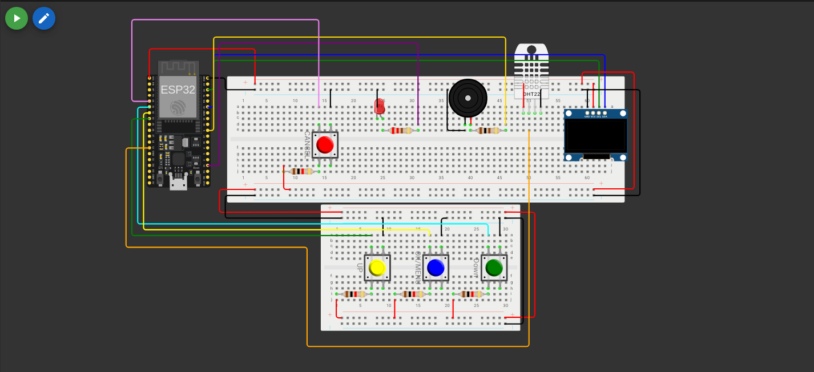
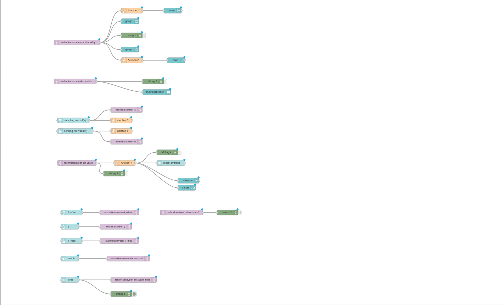
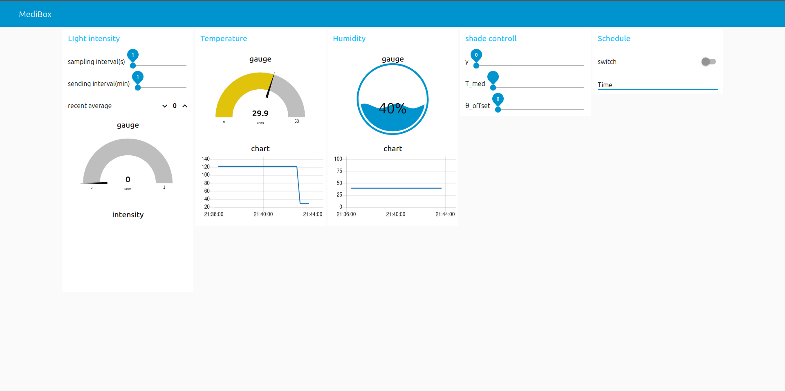

# Smart MediBox

This project, **Smart MediBox**, is part of the EN2853: Embedded Systems and Applications course. The Smart MediBox is designed to help users manage their medication schedules effectively by providing alarm notifications, temperature/humidity monitoring, and dynamic light intensity control.

---

## Features

1. **Set Time Zone**: Configure the time zone dynamically based on the UTC offset.
2. **Set Alarms**: Set up to two alarms for medication reminders.
3. **View Active Alarms**: Display the currently active alarms on the OLED screen.
4. **Delete Alarms**: Remove specific alarms as needed.
5. **Alarm Notifications**: Ring a buzzer and blink an LED when an alarm is triggered.
6. **Snooze Functionality**: Snooze alarms for 5 minutes using a button.
7. **Temperature and Humidity Monitoring**: Display warnings if the temperature or humidity goes out of range.
8. **Light Intensity Monitoring**:
   - Uses an LDR to measure light intensity.
   - Readings are taken at a configurable sampling interval (default: 5 seconds).
   - Average values are calculated over a configurable sending interval (default: 2 minutes) and sent to the Node-RED dashboard.
   - Node-RED dashboard includes:
     - Numerical display for the most recent average light intensity (range: 0 to 1).
     - Chart to visualize historical average values.
     - Sliders to adjust:
       - Sampling interval (`ts`)
       - Sending interval (`tu`)
9. **Dynamic Shaded Sliding Window**:
   - Prevents excessive light from entering the Medibox using a servo motor.
   - Servo motor adjusts its angle (0–180°) based on light intensity and temperature.
   - The angle is calculated using the equation:
     ```
     θ = θoffset + (180 − θoffset) × I × γ × ln(ts/tu) × T/Tmed
     ```
     Where:
     - `θ`: Motor angle
     - `θoffset`: Minimum angle (default: 30°)
     - `I`: Light intensity (0 to 1)
     - `γ`: Controlling factor (default: 0.75)
     - `ts`: Sampling interval (seconds)
     - `tu`: Sending interval (seconds)
     - `T`: Measured temperature (°C)
     - `Tmed`: Ideal storage temperature (default: 30°C)
   - Node-RED dashboard includes sliders to adjust:
     - Minimum angle (`θoffset`): 0–120°
     - Controlling factor (`γ`): 0–1
     - Ideal storage temperature (`Tmed`): 10–40°C

---

## Versioning

- **Current Version:** [`rashmika-version3-220734B`](https://github.com/rashmikanaveen/MediBox_220734B/tree/rashmika-version3-220734B)
  - This branch contains the latest updates, including:
    - Light intensity monitoring with configurable intervals.
    - Dynamic shaded sliding window controlled by a servo motor.
    - Enhanced Node-RED dashboard for real-time monitoring and control.
  - Recommended for users who want the most up-to-date features.

- **Previous Versions:**
  - `version2-220734B`: Added temperature and humidity monitoring.
  - `main`: Initial implementation with basic alarm functionality.

---


---

## Versioning

- **Current Version:** [`rashmika-version3-220734B`](https://github.com/rashmikanaveen/MediBox_220734B/tree/rashmika-version3-220734B)
  - This branch contains the latest updates, including:
    - Light intensity monitoring with configurable intervals.
    - Dynamic shaded sliding window controlled by a servo motor.
    - Enhanced Node-RED dashboard for real-time monitoring and control.
  - Recommended for users who want the most up-to-date features.

- **Previous Versions:**
  - `version2-220734B`: Added temperature and humidity monitoring.
  - `main`: Initial implementation with basic alarm functionality.

---
---

## Platforms Used

### Wokwi
- The **Wokwi Simulator** was used to design and simulate the hardware components of the Smart MediBox.
- Wokwi provides a virtual environment to test the ESP32, OLED display, DHT22 sensor, buzzer, servo motor, and push buttons without requiring physical hardware.
- [Visit Wokwi](https://wokwi.com/) to learn more.
- **View the Smart MediBox Project on Wokwi**: [Smart MediBox on Wokwi](https://wokwi.com/projects/426657665966733313)

### PlatformIO
- **PlatformIO** was used as the development environment for writing, building, and uploading the firmware to the ESP32.
- PlatformIO simplifies dependency management and provides advanced debugging tools.
- [Visit PlatformIO](https://platformio.org/) to learn more.

---

## Hardware Components

- **ESP32 DevKit v1**: Microcontroller for managing the system.
- **SSD1306 OLED Display**: Displays time, alarms, notifications, and light intensity information.
- **DHT22 Sensor**: Monitors temperature and humidity.
- **LDR**: Measures light intensity.
- **Servo Motor**: Adjusts the shaded sliding window based on environmental conditions.
- **Buzzer**: Provides audible alarm notifications.
- **Push Buttons**: Used for menu navigation and alarm control.
- **LED**: Blinks during alarm notifications.

---

## Software Features

- **PlatformIO**: Used for development and deployment.
- **Libraries**:
  - Adafruit GFX Library
  - Adafruit SSD1306 Library
  - DHT Sensor Library for ESPx
- **NTP Synchronization**: Synchronizes time using an NTP server.

---

## Images

### MediBox Simulation


### Flows


### Node-RED Dashboard


---

## How It Works

1. **Set Time Zone**:
   - Use the menu to input the UTC offset for your location.
   - The system synchronizes time using an NTP server.

2. **Set Alarms**:
   - Navigate to the "Set Alarm" menu to configure up to two alarms.
   - Use the buttons to adjust the hour and minute.

3. **Alarm Notifications**:
   - When an alarm is triggered, the buzzer rings, and the LED blinks.
   - Use the "Cancel" button to stop the alarm or the "OK" button to snooze it for 5 minutes.

4. **Temperature and Humidity Monitoring**:
   - The system continuously monitors the environment.
   - Displays warnings if the temperature exceeds 32°C or drops below 24°C, or if the humidity goes out of the 65%-80% range.

5. **Light Intensity Monitoring**:
   - LDR readings are taken at regular intervals (default: 5 seconds).
   - Average values are calculated over a configurable period (default: 2 minutes) and sent to the Node-RED dashboard.
   - The dashboard includes a numerical display, chart, and sliders for configuration.

6. **Dynamic Shaded Sliding Window**:
   - The servo motor adjusts the window angle based on light intensity and temperature.
   - The angle is calculated using the environmental equation provided above.
   - Users can adjust parameters (`θoffset`, `γ`, `Tmed`) via the Node-RED dashboard.

---

## Circuit Diagram

The circuit diagram for the Smart MediBox is available in the Wokwi simulator.

---

## How to Run

1. Clone this repository to your local machine.
2. Open the project in PlatformIO.
3. Connect the hardware components as per the circuit diagram.
4. Build and upload the code to the ESP32.
5. Use the buttons to navigate the menu and set alarms.
6. Configure light intensity monitoring and sliding window parameters via the Node-RED dashboard.

---

## Acknowledgments

This project was developed as part of the **EN2853: Embedded Systems and Applications** course. Special thanks to:
- **Wokwi Simulator** for providing a platform to design and test the project virtually.
- **PlatformIO** for simplifying the development and deployment process.

---

## License

This project is licensed under the MIT License. See the `LICENSE` file for details.
